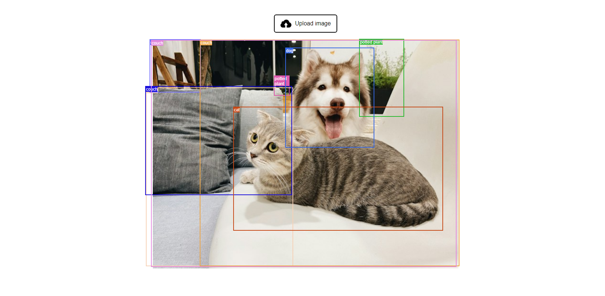

# Object Detector - Vanilla JavaScript Application

A simple web application that detects objects in images using Transformers.js.

    

## Features

- setting up the project.
- creating an object detection pipeline.
- creating the image uploader.
- running the model.
- rendering the boxes.

Based on [Building a Vanilla JavaScript Application](https://huggingface.co/docs/transformers.js/tutorials/vanilla-js) by Transformers.js (2023).
