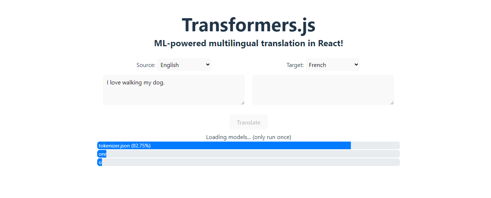

# React Translator

A simple React application that performs multilingual translation using Transformers.js.

<p align="center">
    
</p>

## Usage

To set up the project, run the following commands:

```
npm install
npm run dev
```

If you want to use a model locally from your public folder during dev mode, follow this [workaround](https://stackoverflow.com/a/77099248).

Otherwise, if you prefer to use the remote model, you need to build first:

```
npm run build
npm run preview
```

## Features

- setting up the project with Vite.
- installing and configuring Transformers.js.
- designing the user interface.
- connecting everything together.

Based on [Building a React application](https://huggingface.co/docs/transformers.js/tutorials/react) by Transformers.js (2023).
