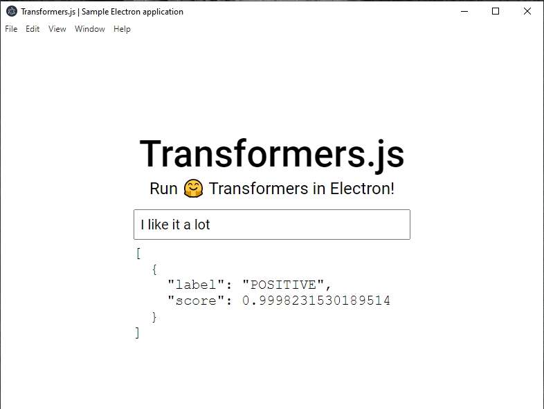

# Sentiment Analysis - Electron application

An example project to show how to run Transformers.js in an Electron application.

<p align="center">
    
</p>

## Getting Started

1. Clone the repo and enter the project directory:
   ```bash
   git clone https://github.com/solygambas/mlops-projects.git
   cd 00-playground/01-tansformersjs/05-electron-app
   ```
1. Install the necessary dependencies:

   ```bash
   npm install
   ```

1. Run the application:

   ```bash
   npm run start
   ```

   After a few seconds, a new window should pop up on your screen!

## Editing the template

All source code can be found in `./src/`:

- `index.js` - Serves as the entry point for the application's main process. When an Electron app is launched, this is the first file that gets executed, and it is responsible for setting up the main process of the application. You will need to restart the application after editing this file for your changes to take effect.
- `preload.js` - Used to preload scripts and modules in a renderer process before any other scripts run. In our case, we use the `contextBridge` API to expose the `run` function to the renderer, which runs the model in the background. You will need to restart the application after editing this file for your changes to take effect.
- `model.js` - Contains all the logic for loading the model and running predictions. You will need to restart the application after editing this file for your changes to take effect.

- `client.js` - Handles interaction with the interface, as well as communication between the renderer thread (UI) and the worker thread (processing). To see changes made to this file made while editing, simply refresh the window (<kbd>Ctrl + R</kbd> or "View" &rarr; "Reload").
- `index.html`, `index.css` - The user interface which is displayed to the user. To see changes made to this file made while editing, simply refresh the window (<kbd>Ctrl + R</kbd> or "View" &rarr; "Reload").

Based on [Building an Electron application](https://huggingface.co/docs/transformers.js/tutorials/electron) by Transformers.js (2023).
